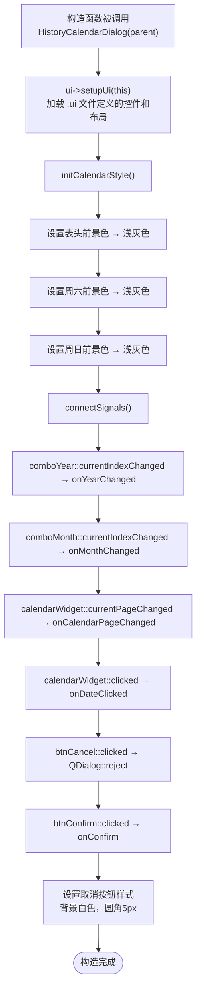
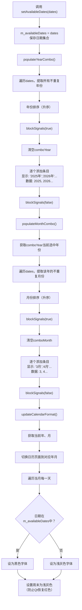
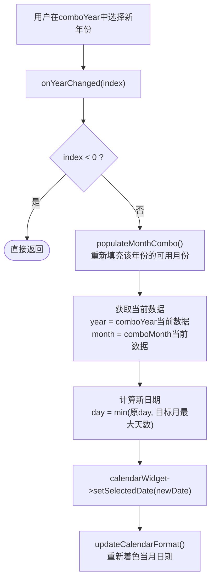
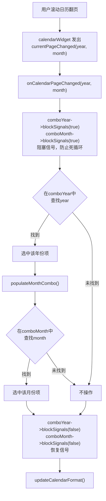
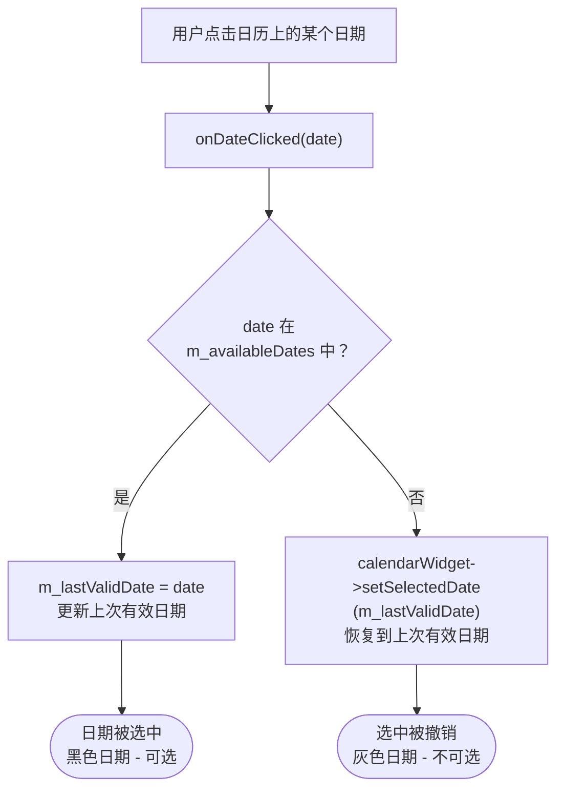
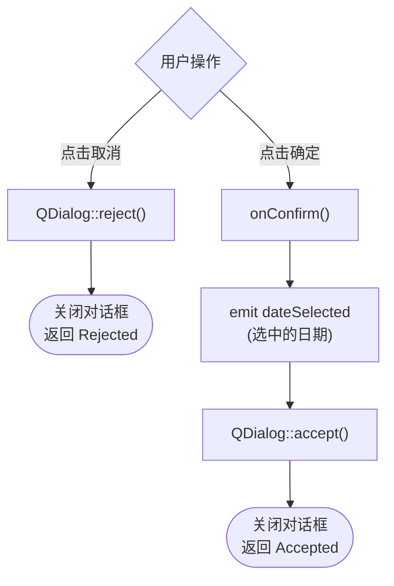
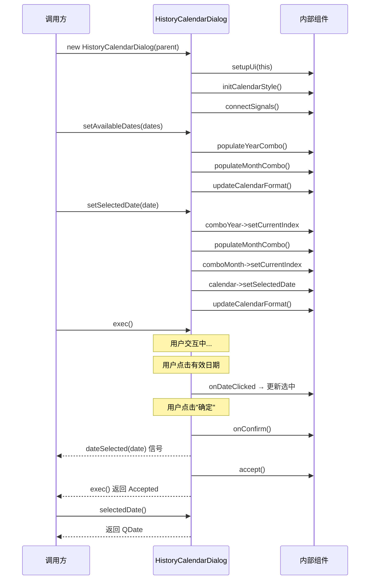
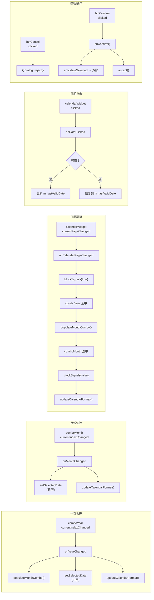
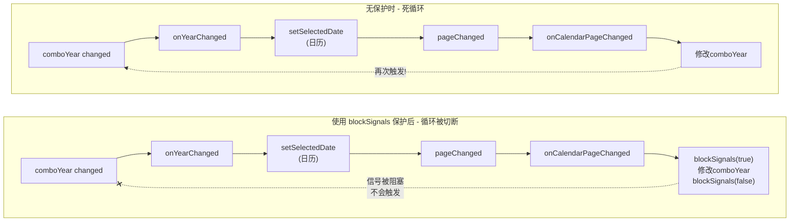

# HistoryCalendarDialog 设计文档

## 1. 概述

`HistoryCalendarDialog` 是一个基于 Qt 的**历史记录日历模态对话框**控件。用于在给定一组有历史记录的日期集合后，以日历形式展示给用户，让用户从中选择一个有效的历史日期。

### 核心特性

- **仅展示有历史记录的年月**：年份和月份下拉框只列出有数据的选项
- **视觉区分**：有历史记录的日期显示为黑色字体，无记录的日期显示为浅灰色
- **选择保护**：用户无法选中没有历史记录的灰色日期
- **信号通知**：用户确认选择后，通过信号发射选中的日期

---

## 2. 文件结构

```
HistoryCalendarDialog
├── historycalendardialog.h      // 类声明（头文件）
├── historycalendardialog.cpp    // 类实现（源文件）
└── historycalendardialog.ui     // UI布局（Qt Designer文件）
```

---

## 3. UI 布局设计

### 3.1 整体结构（historycalendardialog.ui）

采用 `QVBoxLayout` 垂直布局，从上到下依次排列四个区域：

```
┌─────────────────────────────────────────┐
│  labelTitle（"选择发送日期"）              │  ← QLabel, 12pt字体
├─────────────────────────────────────────┤
│  comboYear    comboMonth    [stretch]    │  ← QHBoxLayout, 间距20
├─────────────────────────────────────────┤
│                                         │
│            calendarWidget               │  ← QCalendarWidget, 最小高度280
│                                         │
├─────────────────────────────────────────┤
│           [stretch]   btnCancel  btnConfirm │  ← QHBoxLayout, 右对齐
└─────────────────────────────────────────┘
```

### 3.2 控件清单

| 控件名称 | 类型 | 说明 |
|---|---|---|
| `labelTitle` | QLabel | 标题标签，显示"选择发送日期"，字体12pt |
| `comboYear` | QComboBox | 年份下拉框，最小120×40，字体11pt |
| `comboMonth` | QComboBox | 月份下拉框，最小120×40，字体11pt |
| `calendarWidget` | QCalendarWidget | 日历控件，最小高度280，隐藏导航栏，显示网格 |
| `btnCancel` | QPushButton | 取消按钮，最小100×40 |
| `btnConfirm` | QPushButton | 确定按钮，最小100×40 |

### 3.3 布局参数

- **主布局间距**：15px
- **主布局边距**：上下左右各20px
- **下拉框行间距**：20px
- **按钮行**：左侧弹性空间将按钮推向右侧

---

## 4. 公开接口详解

### 4.1 构造函数与析构函数

```cpp
explicit HistoryCalendarDialog(QWidget *parent = nullptr);
~HistoryCalendarDialog();
```

- **构造函数**：创建对话框实例。`parent` 参数指定父窗口，对话框以模态方式运行。构造时自动完成UI初始化、日历样式设置和信号槽连接。
- **析构函数**：释放 `ui` 指针所管理的UI资源。

---

### 4.2 setAvailableDates

```cpp
void setAvailableDates(const QSet<QDate> &dates);
```

**功能**：设置有历史记录的日期集合。这是使用该控件前**必须调用**的方法。

**参数**：
- `dates`：`QSet<QDate>` 类型，包含所有有历史记录的日期

**内部行为**：
1. 保存日期集合到 `m_availableDates`
2. 从集合中提取所有不重复的年份，填充年份下拉框（`populateYearCombo`）
3. 根据当前年份提取月份，填充月份下拉框（`populateMonthCombo`）
4. 更新日历的日期格式（`updateCalendarFormat`）

**示例**：
```cpp
QSet<QDate> dates;
dates.insert(QDate(2026, 4, 1));
dates.insert(QDate(2026, 4, 2));
dates.insert(QDate(2026, 4, 3));
dates.insert(QDate(2026, 3, 15));
dialog.setAvailableDates(dates);
```

---

### 4.3 selectedDate

```cpp
QDate selectedDate() const;
```

**功能**：获取用户当前在日历上选中的日期。

**返回值**：`QDate` 类型，当前选中的日期。

**使用场景**：在 `exec()` 返回 `QDialog::Accepted` 之后调用，获取用户最终确认的日期。

---

### 4.4 setSelectedDate

```cpp
void setSelectedDate(const QDate &date);
```

**功能**：以编程方式设置日历的选中日期，同时同步年份和月份下拉框。

**参数**：
- `date`：要选中的日期，必须为有效日期

**内部行为**：
1. 在年份下拉框中查找并选中对应年份
2. 重新填充月份下拉框
3. 在月份下拉框中查找并选中对应月份
4. 设置日历选中日期
5. 如果该日期在可用日期集合中，更新 `m_lastValidDate`
6. 刷新日历格式

---

### 4.5 dateSelected 信号

```cpp
signals:
    void dateSelected(const QDate &date);
```

**功能**：当用户点击"确定"按钮时发射此信号，携带用户选择的日期。

**参数**：
- `date`：用户最终确认选择的日期

**使用方式**：
```cpp
connect(&dialog, &HistoryCalendarDialog::dateSelected, [](const QDate &date) {
    qDebug() << "用户选择了日期:" << date.toString("yyyy-MM-dd");
});
```

---

## 5. 内部实现详解

### 5.1 构造函数流程

```cpp
HistoryCalendarDialog::HistoryCalendarDialog(QWidget *parent)
    : QDialog(parent)
    , ui(new Ui::HistoryCalendarDialog)
{
    ui->setupUi(this);        // 1. 加载UI布局
    initCalendarStyle();       // 2. 初始化日历样式
    connectSignals();          // 3. 连接信号槽

    // 4. 设置取消按钮样式（白色背景）
    ui->btnCancel->setStyleSheet(...);
}
```

---

### 5.2 initCalendarStyle —— 日历样式初始化

```cpp
void HistoryCalendarDialog::initCalendarStyle()
```

**职责**：设置日历控件的默认视觉样式。

**实现细节**：

| 设置项 | 值 | 目的 |
|---|---|---|
| 表头文字颜色 | `QColor(200, 200, 200)` 浅灰色 | 星期表头统一浅灰 |
| 周六文字颜色 | `QColor(200, 200, 200)` 浅灰色 | 覆盖Qt默认的红色 |
| 周日文字颜色 | `QColor(200, 200, 200)` 浅灰色 | 覆盖Qt默认的红色 |

使用 `QTextCharFormat` 设置前景色，通过 `setHeaderTextFormat` 和 `setWeekdayTextFormat` 应用。

---

### 5.3 connectSignals —— 信号槽连接

```cpp
void HistoryCalendarDialog::connectSignals()
```

建立以下6组信号槽连接：

| 信号源 | 信号 | 槽函数 | 作用 |
|---|---|---|---|
| `comboYear` | `currentIndexChanged(int)` | `onYearChanged` | 年份切换时更新月份和日历 |
| `comboMonth` | `currentIndexChanged(int)` | `onMonthChanged` | 月份切换时更新日历 |
| `calendarWidget` | `currentPageChanged(int,int)` | `onCalendarPageChanged` | 日历翻页时同步下拉框 |
| `calendarWidget` | `clicked(QDate)` | `onDateClicked` | 点击日期时验证是否可选 |
| `btnCancel` | `clicked()` | `QDialog::reject` | 取消并关闭对话框 |
| `btnConfirm` | `clicked()` | `onConfirm` | 确认选择并发射信号 |

---

### 5.4 populateYearCombo —— 填充年份下拉框

```cpp
void HistoryCalendarDialog::populateYearCombo()
```

**算法**：
1. 遍历 `m_availableDates`，用 `QSet<int>` 收集所有不重复的年份
2. 将年份排序（升序）
3. 阻塞 `comboYear` 的信号（防止填充过程中触发 `onYearChanged`）
4. 清空下拉框，逐个添加条目（显示文本为 "2026年"，绑定数据为整数 `2026`）
5. 恢复信号

**关键点**：使用 `blockSignals(true/false)` 包裹填充操作，避免级联触发。

---

### 5.5 populateMonthCombo —— 填充月份下拉框

```cpp
void HistoryCalendarDialog::populateMonthCombo()
```

**算法**：
1. 获取当前年份下拉框选中的年份值
2. 遍历 `m_availableDates`，收集属于该年份的所有不重复月份
3. 月份排序（升序）
4. 阻塞信号 → 清空 → 填充 → 恢复信号

**依赖**：依赖 `comboYear` 的当前选中项，因此必须在年份确定后调用。

---

### 5.6 updateCalendarFormat —— 更新日历日期颜色

```cpp
void HistoryCalendarDialog::updateCalendarFormat()
```

**核心逻辑**：根据有无历史记录，为当月每一天设置不同的字体颜色。

**算法**：
1. 获取当前年份和月份
2. 如果年或月为0（数据无效），直接返回
3. 切换日历到对应年月页面
4. 定义两种格式：
   - `defaultFormat`：前景色 `QColor(200, 200, 200)` —— 浅灰色（无记录）
   - `availableFormat`：前景色 `QColor(0, 0, 0)` —— 黑色（有记录）
5. 遍历当月每一天，根据是否在 `m_availableDates` 中决定使用哪种格式
6. 最后再次设置周末颜色为浅灰色（防止被步骤5的逐日设置覆盖后，Qt内部又恢复红色）

---

### 5.7 onYearChanged —— 年份切换响应

```cpp
void HistoryCalendarDialog::onYearChanged(int index)
```

**流程**：
1. 如果 `index < 0`（无选中项），直接返回
2. 调用 `populateMonthCombo()` 重新填充月份（因为不同年份的可用月份不同）
3. 获取新的年、月值
4. 计算新日期（保持日不变，但不超过目标月份的最大天数）
5. 设置日历选中日期
6. 刷新日历格式

---

### 5.8 onMonthChanged —— 月份切换响应

```cpp
void HistoryCalendarDialog::onMonthChanged(int index)
```

**流程**：与 `onYearChanged` 类似，但不需要重新填充月份下拉框。

---

### 5.9 onCalendarPageChanged —— 日历翻页响应

```cpp
void HistoryCalendarDialog::onCalendarPageChanged(int year, int month)
```

**触发时机**：用户通过滚轮等方式在日历上翻页时触发。

**流程**：
1. 阻塞年份和月份下拉框的信号（**关键**：防止反向触发形成死循环）
2. 在年份下拉框中查找对应年份并选中
3. 重新填充月份下拉框
4. 在月份下拉框中查找对应月份并选中
5. 恢复信号
6. 刷新日历格式

---

### 5.10 onDateClicked —— 日期点击验证

```cpp
void HistoryCalendarDialog::onDateClicked(const QDate &date)
```

**功能**：保护机制，确保用户只能选中有历史记录的日期。

**逻辑**：
- 如果点击的日期**在** `m_availableDates` 中 → 更新 `m_lastValidDate` 为该日期
- 如果点击的日期**不在** `m_availableDates` 中 → 恢复日历选中为 `m_lastValidDate`

---

### 5.11 onConfirm —— 确认按钮响应

```cpp
void HistoryCalendarDialog::onConfirm()
```

**流程**：
1. 发射 `dateSelected` 信号，携带当前选中日期
2. 调用 `accept()` 关闭对话框并返回 `QDialog::Accepted`

---

## 6. 成员变量说明

| 变量 | 类型 | 说明 |
|---|---|---|
| `ui` | `Ui::HistoryCalendarDialog*` | UI界面指针，管理所有ui文件中定义的控件 |
| `m_availableDates` | `QSet<QDate>` | 有历史记录的日期集合，用于颜色区分和选择验证 |
| `m_lastValidDate` | `QDate` | 上一次有效的选中日期，用于在用户点击灰色日期时恢复选中 |

---

## 7. 完整使用过程

### 7.1 基本使用步骤

```cpp
#include "historycalendardialog.h"

// 步骤1：创建对话框实例
HistoryCalendarDialog dialog(this);

// 步骤2：准备有历史记录的日期集合
QSet<QDate> availableDates;
availableDates.insert(QDate(2025, 12, 1));
availableDates.insert(QDate(2025, 12, 15));
availableDates.insert(QDate(2026, 1, 5));
availableDates.insert(QDate(2026, 3, 10));
availableDates.insert(QDate(2026, 3, 20));
availableDates.insert(QDate(2026, 4, 1));
availableDates.insert(QDate(2026, 4, 2));
availableDates.insert(QDate(2026, 4, 3));

// 步骤3：设置可用日期（必须在setSelectedDate之前调用）
dialog.setAvailableDates(availableDates);

// 步骤4：设置默认选中日期（可选）
dialog.setSelectedDate(QDate(2026, 4, 1));

// 步骤5：连接信号（可选）
connect(&dialog, &HistoryCalendarDialog::dateSelected, [](const QDate &date) {
    qDebug() << "选中日期:" << date.toString("yyyy-MM-dd");
});

// 步骤6：显示模态对话框
if (dialog.exec() == QDialog::Accepted) {
    QDate selected = dialog.selectedDate();
    // 使用选中的日期...
}
```

### 7.2 调用时序说明

> **重要**：`setAvailableDates` 必须在 `setSelectedDate` 之前调用，因为后者依赖前者填充的下拉框数据来定位年份和月份。

---

## 8. 流程图

### 8.1 对话框初始化流程



---

### 8.2 setAvailableDates 调用流程



---

### 8.3 用户交互：年份切换流程



---

### 8.4 用户交互：日历翻页流程



---

### 8.5 用户交互：点击日期流程



---

### 8.6 用户交互：确认/取消流程



---

### 8.7 完整使用时序图



---

### 8.8 信号槽联动关系图



---

### 8.9 防止信号循环的机制



---

## 9. 颜色方案

| 元素 | 颜色 | RGB值 | 说明 |
|---|---|---|---|
| 有历史记录的日期 | 黑色 | `(0, 0, 0)` | 表示可选 |
| 无历史记录的日期 | 浅灰色 | `(200, 200, 200)` | 表示不可选 |
| 星期表头 | 浅灰色 | `(200, 200, 200)` | 统一风格 |
| 周末日期（无记录） | 浅灰色 | `(200, 200, 200)` | 覆盖Qt默认红色 |
| 取消按钮背景 | 白色 | `white` | 简洁风格 |
| 取消按钮边框 | 浅灰色 | `#d0d0d0` | 1px实线 |
| 确定按钮 | 系统默认 | — | 不自定义样式 |

---

## 10. 注意事项

1. **调用顺序**：必须先调用 `setAvailableDates()`，再调用 `setSelectedDate()`
2. **空集合**：如果传入空的日期集合，下拉框将为空，日历全部显示灰色
3. **日期验证**：`m_lastValidDate` 初始为无效 `QDate()`，因此必须通过 `setSelectedDate` 设置一个初始有效日期
4. **信号安全**：内部使用 `blockSignals` 防止信号循环，外部连接 `dateSelected` 信号不受影响
5. **模态运行**：对话框以模态方式运行，`exec()` 会阻塞调用方直到用户操作完成
