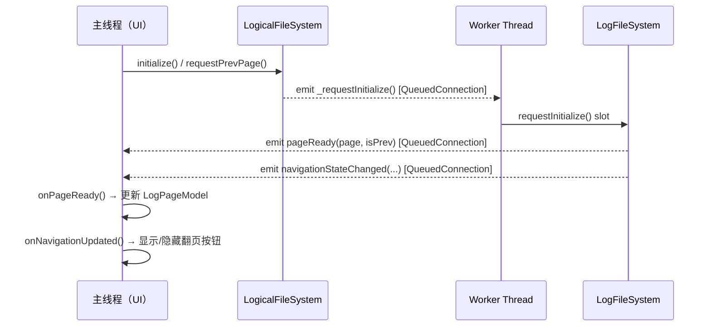
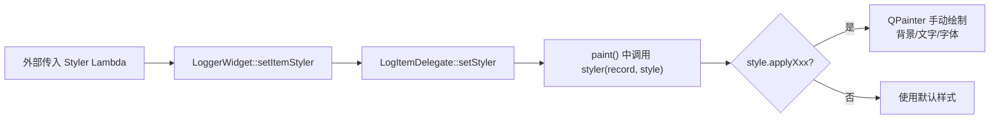
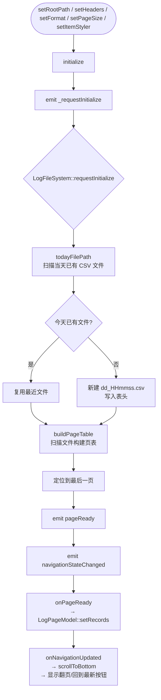
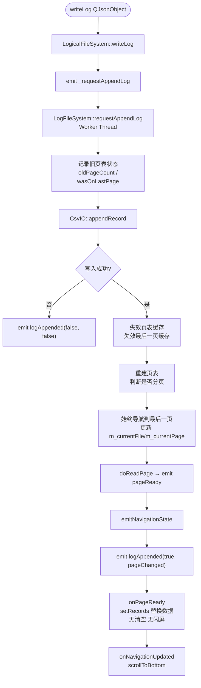
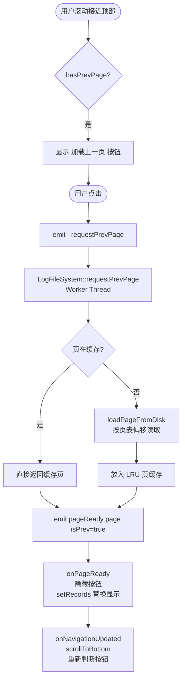
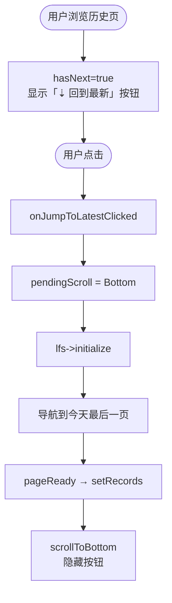

# LoggerWidget 设计文档

## 一、概述

`LoggerWidget` 是一个基于 Qt 的异步日志查看控件，支持：

- 将结构化日志以 CSV 格式追加写入本地文件
- 按分页方式展示历史日志，支持向上/向下翻页
- 写入与读取均在独立工作线程中执行，不阻塞 UI 主线程
- 可自定义每条记录的显示格式，空字段自动跳过
- 可通过回调函数自定义每行的字体颜色、背景色和字体（绕过 QSS/原生主题）
- 写入日志后自动切换到最新页，同页追加无闪屏

---

## 二、架构设计

### 2.1 分层结构

控件共分四个层次，从底至上依次为：

```
┌──────────────────────────────────────────────┐
│         LoggerWidget                  │  ← UI 层（QWidget）
│   ┌──────────────┐  ┌────────────────────┐   │
│   │ LogPageModel │  │ LogItemDelegate    │   │  ← 模型层 + 绘制委托
│   └──────────────┘  └────────────────────┘   │
│   ┌──────────────┐  ┌────────────────────┐   │
│   │ ItemStyle    │  │ LoadMoreItemWidget │   │  ← 样式描述 + 翻页按钮
│   └──────────────┘  └────────────────────┘   │
├──────────────────────────────────────────────┤
│           LogicalFileSystem                  │  ← 逻辑代理层（主线程）
├──────────────────────────────────────────────┤
│      LogFileSystem（Worker Thread）          │  ← 文件系统层（独立线程，LRU 缓存）
├──────────────────────────────────────────────┤
│               CsvIO                          │  ← I/O 工具层（CSV 读写）
└──────────────────────────────────────────────┘
```

### 2.2 文件结构

每个类/结构体独立存放在单独的文件中：

| 文件 | 内容 |
|---|---|
| `ItemStyle.h` | `ItemStyle` 结构体（纯头文件，无 .cpp） |
| `LoadMoreItemWidget.h/.cpp` | `LoadMoreItemWidget` 翻页按钮控件 |
| `LogPageModel.h/.cpp` | `LogPageModel` 数据模型 |
| `LogItemDelegate.h/.cpp` | `LogItemDelegate` 自定义绘制委托 |
| `LoggerWidget.h/.cpp` | `LoggerWidget` 主控件 |
| `LogicalFileSystem.h/.cpp` | `LogicalFileSystem` 逻辑代理层 |
| `LogFileSystem.h/.cpp` | `LogFileSystem` 文件系统层 |
| `CsvIO.h/.cpp` | `CsvIO` CSV 读写工具 |
| `LRUCache.h` | `LRUCache` 模板类（纯头文件） |
| `PageTable.h` | `PageTableEntry`、`PageTable`、`PageKey`、`Page` 结构体 |

### 2.3 线程模型



`LogFileSystem` 通过 `QThread::moveToThread()` 迁移到独立线程，所有公开方法均以 **槽函数** 形式提供，主线程通过发射信号触发，结果通过信号回传，无需任何互斥锁。

### 2.4 LRU 缓存

`LogFileSystem` 内部维护两级 LRU 缓存：

| 缓存 | 键 | 容量 | 用途 |
|---|---|---|---|
| `m_pageCache` | `{filePath, pageIndex}` | 3 页 | 缓存已读取的页内容 |
| `m_ptCache` | `filePath` | 5 个文件 | 缓存文件的页偏移表 |

追加日志成功后，立即失效对应文件的页表缓存及最后一页的页缓存，确保下次读取得到最新数据。

### 2.5 样式机制

行样式通过 `ItemStyle` + `LogItemDelegate` 实现，完全绕过 QSS 和原生主题：



---

## 三、流程图

### 3.1 启动初始化流程



### 3.2 写入日志流程



**关键设计**：写入后 Worker 直接导航到最后一页并 emit `pageReady`，Widget 侧仅做 `setRecords` 替换（非清空+重载），**消除闪屏**。无论用户当前在哪一页，写入后都会自动切换到正在写入的页面。

### 3.3 翻页流程



### 3.4 "回到最新"流程



---

## 四、类层次与接口

### 4.1 `CsvIO`（I/O 工具层）

> 文件：`CsvIO.h` / `CsvIO.cpp`

纯静态工具类，所有方法线程安全（无共享状态）。

| 方法 | 说明 |
|---|---|
| `static bool writeHeader(path, headers)` | 创建文件并写入表头行（Truncate） |
| `static bool appendRecord(path, headers, record)` | 按表头顺序将 JSON 追加写入 CSV（Append） |
| `static QVector<QStringList> readPage(path, pt, pageIdx)` | 按页表偏移读取指定页的记录 |
| `static PageTable buildPageTable(path, pageSize)` | 扫描文件，构建每页的字节偏移表 |

### 4.2 `LogFileSystem`（文件系统层，Worker Thread）

> 文件：`LogFileSystem.h` / `LogFileSystem.cpp`

#### 配置方法（`moveToThread` 前调用）

| 方法 | 说明 |
|---|---|
| `setRootPath(path)` | 设置日志根目录 |
| `setPageSize(size)` | 设置每页记录数（默认 50） |
| `setHeaders(headers)` | 设置 CSV 表头列表 |

#### 公开槽（Worker Thread 中执行）

| 槽 | 说明 |
|---|---|
| `requestInitialize()` | 定位到今天文件的最后一页并发出 `pageReady` |
| `requestPrevPage()` | 向上翻一页 |
| `requestNextPage()` | 向下翻一页 |
| `requestAppendLog(record)` | 追加日志；**始终导航到最后一页**并 emit `pageReady` |
| `requestCleanOldLogs()` | 清理超过 6 个月的月份目录 |

#### 信号

| 信号 | 说明 |
|---|---|
| `pageReady(page, isPrev)` | 页数据就绪 |
| `loadProgress(percent)` | 加载进度 0~100 |
| `loadFailed(reason)` | 加载失败原因 |
| `logAppended(success, pageChanged)` | 追加结果；`pageChanged` 表示是否发生分页或页面切换 |
| `navigationStateChanged(hasPrev, hasNext, file, page, pageCount)` | 导航状态变化 |

#### 私有方法

| 方法 | 说明 |
|---|---|
| `todayFilePath()` | 获取/缓存今天的 CSV 文件路径；优先复用已有文件 |
| `getPageTable(filePath)` | 从缓存或磁盘获取页偏移表 |
| `loadPageTable(filePath)` | 扫描磁盘重建页表并置入缓存 |
| `doReadPage(filePath, pageIndex)` | 读取指定页（先查缓存，未命中则从磁盘加载） |
| `flushPage(key)` | 将脏页写回磁盘 |
| `emitNavigationState(isPrev)` | 计算并发出导航状态信号 |
| `hasPrevInternal()` / `hasNextInternal()` | 判断是否存在上/下页 |
| `allLogFiles()` / `allMonthDirs()` | 枚举所有日志文件/月份目录 |

### 4.3 `LogicalFileSystem`（逻辑代理层，主线程）

> 文件：`LogicalFileSystem.h` / `LogicalFileSystem.cpp`

管理 `LogFileSystem` 实例的线程生命周期，通过信号转发实现主线程 → Worker 的异步调度。

#### 公开方法

| 方法 | 说明 |
|---|---|
| `setRootPath(path)` | 转发配置到 `LogFileSystem` |
| `setPageSize(size)` | 转发配置到 `LogFileSystem` |
| `setHeaders(headers)` | 转发配置到 `LogFileSystem` |
| `initialize()` | 触发初始化（发射 `_requestInitialize`） |
| `requestPrevPage()` | 请求上一页 |
| `requestNextPage()` | 请求下一页 |
| `writeLog(record)` | 触发异步写入（发射 `_requestAppendLog`） |
| `hasPrevPage()` / `hasNextPage()` | 查询当前缓存的导航状态 |

#### 信号（转发自 `LogFileSystem`）

| 信号 | 说明 |
|---|---|
| `pageReady(page, isPrev)` | 页数据就绪 |
| `loadProgress(percent)` | 加载进度 |
| `loadFailed(reason)` | 加载失败 |
| `logAppended(success, pageChanged)` | 追加结果（含分页标识） |
| `navigationUpdated(hasPrev, hasNext)` | 导航状态更新 |

#### 私有槽

| 槽 | 说明 |
|---|---|
| `onNavigationStateChanged(...)` | 更新本地缓存的导航状态，发出 `navigationUpdated` |
| `onMidnightCleanup()` | 每天零点触发清理旧日志 |

### 4.4 `ItemStyle`（样式描述）

> 文件：`ItemStyle.h`（纯头文件）

| 成员 | 说明 |
|---|---|
| `QColor foreground` | 文字颜色 |
| `QColor background` | 背景颜色 |
| `QFont font` | 字体 |
| `bool applyForeground/applyBackground/applyFont` | 是否应用对应样式（默认 false） |
| `setForeground(c)` / `setBackground(c)` / `setFont(f)` | 设置样式并标记为启用 |

### 4.5 `LogItemDelegate`（自定义绘制委托）

> 文件：`LogItemDelegate.h` / `LogItemDelegate.cpp`

继承 `QStyledItemDelegate`，在 `paint()` 中使用 `QPainter` 手动绘制背景和文字，绕过 QSS/Windows 原生主题。

| 方法 | 说明 |
|---|---|
| `setStyler(Styler fn)` | 设置样式回调函数 |
| `paint(...)` | 通过 `qobject_cast` 获取 `LogPageModel`，调用 `recordAt()` 取原始记录，传入 styler 获取 `ItemStyle` 后手动绘制 |

`Styler` 类型定义：`std::function<void(const QStringList &record, ItemStyle &style)>`

### 4.6 `LogPageModel`（数据模型层）

> 文件：`LogPageModel.h` / `LogPageModel.cpp`

继承 `QAbstractListModel`，为 `QListView` 提供数据。

#### 公开方法

| 方法 | 说明 |
|---|---|
| `setCsvHeaders(headers)` | 设置 CSV 列顺序（用于按名称查找列索引） |
| `setFormat(format, args)` | 设置显示格式模板，见下方说明 |
| `setRecords(records)` | 替换当前页全部记录，触发视图刷新 |
| `recordAt(row)` | 返回指定行的原始 CSV 记录（供 `LogItemDelegate` 使用） |

#### `setFormat` 格式规则

```
setFormat("[{}][{}][{}]:{}", {"level","时间","qrcode","具体信息"})
```

- 格式字符串中每个 `{}` 对应 `args` 里的一个表头名称
- 渲染时按表头名从 CSV 记录中取值；值为空则跳过整个 `prefix+value+suffix`
- 段间文本通过"闭合字符集 `])}>`"自动分割为前字段 suffix 和后字段 prefix

#### 私有方法

| 方法 | 说明 |
|---|---|
| `rebuildSlots()` | 解析格式字符串，构建 `FieldSlot` 列表 |
| `formatRow(record)` | 将一条 CSV 记录渲染为显示字符串 |

### 4.7 `LoadMoreItemWidget`（翻页按钮）

> 文件：`LoadMoreItemWidget.h` / `LoadMoreItemWidget.cpp`

状态机：`Idle → Loading → Idle`，嵌入在 `LoggerWidget` 布局顶部/底部。

| 方法 | 说明 |
|---|---|
| `setIdle()` | 显示"加载上/下一页"按钮 |
| `setLoading()` | 切换为加载状态（禁用按钮） |
| `setProgress(percent)` | 更新进度条 |
| `setDone(timeHint)` | 显示时间提示标签 |
| 信号 `clicked()` | 用户点击时发出 |

### 4.8 `LoggerWidget`（UI 层）

> 文件：`LoggerWidget.h` / `LoggerWidget.cpp`

#### 公开方法

| 方法 | 说明 |
|---|---|
| `setRootPath(path)` | 设置日志根目录 |
| `setPageSize(size)` | 设置分页大小 |
| `setHeaders(headers)` | 设置 CSV 表头 |
| `setFormat(format, args)` | 设置显示格式（同 `LogPageModel::setFormat`） |
| `setItemStyler(fn)` | 设置行样式回调：接收 `(const QStringList &record, ItemStyle &style)` |
| `writeLog(record)` | 异步写入一条日志 |
| `initialize()` | 完成配置后调用，开始异步加载 |

#### 信号

| 信号 | 说明 |
|---|---|
| `logWritten(success)` | 日志写入完成后通知外部 |

#### 私有槽

| 槽 | 说明 |
|---|---|
| `onPageReady(page, isPrev)` | 替换 `LogPageModel` 数据（无清空，无闪屏） |
| `onNavigationUpdated(hasPrev, hasNext)` | 执行待定滚动，更新翻页按钮和"回到最新"按钮可见性 |
| `onLogAppended(success, pageChanged)` | 转发 `logWritten` 信号（数据刷新已由 `pageReady` 完成） |
| `onScrollValueChanged(value)` | 滚动位置检测，接近边缘时显示/隐藏翻页按钮 |
| `onTopLoadMoreClicked()` | 请求上一页，设置 `ScrollHint::Bottom` |
| `onBottomLoadMoreClicked()` | 请求下一页，设置 `ScrollHint::Top` |
| `onJumpToLatestClicked()` | 点击"回到最新"按钮，调用 `initialize()` 跳转到最后一页 |
| `onLoadProgress(percent)` | 转发进度到对应翻页按钮 |
| `onLoadFailed(reason)` | 翻页失败，恢复按钮为 Idle 状态 |

#### 私有方法

| 方法 | 说明 |
|---|---|
| `setupUi()` | 构建布局：顶部按钮 + QListView + 底部栏（翻页 + 回到最新） |
| `showTopLoadMore()` / `removeTopLoadMore()` | 显示/隐藏顶部翻页按钮 |
| `showBottomLoadMore()` / `removeBottomLoadMore()` | 显示/隐藏底部翻页按钮 |

#### UI 布局

```
┌──────────────────────────────────────┐
│  LoadMoreItemWidget (Top)   [隐藏]   │  ← 接近顶部 && hasPrev 时显示
├──────────────────────────────────────┤
│                                      │
│            QListView                 │  ← LogPageModel + LogItemDelegate
│                                      │
├──────────────────────┬───────────────┤
│ LoadMoreItemWidget   │ ⇣ 回到最新    │  ← 底部栏（QHBoxLayout）
│ (Bottom) [隐藏]      │ [隐藏]        │
└──────────────────────┴───────────────┘
```

- **底部翻页按钮**：滚动接近底部 && `hasNext` 时显示
- **回到最新按钮**：`hasNext` 为 true 时显示（当前不在最后一页）

---

## 五、使用流程

### 5.1 基本集成步骤


### 5.2 代码示例

```cpp
// 1. 配置（顺序：setHeaders → setFormat → setItemStyler → setPageSize → initialize）
QString logRoot = QCoreApplication::applicationDirPath() + "/logs";
ui->loggerWidget->setRootPath(logRoot);

ui->loggerWidget->setHeaders({
    "level", "时间", "qrcode", "警报id", "是否解决", "解决时间", "具体信息"
});

// 格式：前6字段用[]，最后1字段用:（空字段自动跳过）
ui->loggerWidget->setFormat(
    "[{}][{}][{}][{}][{}][{}]:{}",
    {"level","时间","qrcode","警报id","是否解决","解决时间","具体信息"}
);

// 按 level 字段设置行样式（可选）
ui->loggerWidget->setItemStyler([](const QStringList &record, ItemStyle &style) {
    const QString &level = record.value(0);
    if (level == QStringLiteral("error")) {
        style.setForeground(QColor(255, 80,  80));   // 红色文字
        style.setBackground(QColor(60,  10,  10));   // 深红背景
    } else if (level == QStringLiteral("warn")) {
        style.setForeground(QColor(255, 165,  0));   // 橙色文字
        style.setBackground(QColor(50,  35,   0));   // 深橙背景
    }
    // info：不调用 setXxx，保持默认样式
});

ui->loggerWidget->setPageSize(100);
ui->loggerWidget->initialize();   // 最后调用，触发异步加载

// 2. 连接信号
connect(ui->loggerWidget, &LoggerWidget::logWritten,
        this, [](bool ok) {
            if (!ok) qWarning() << "日志写入失败";
        });

// 3. 写入日志（可在任意时刻调用，写入后自动切换到最新页）
QJsonObject record;
record["level"]   = "info";
record["时间"]    = QDateTime::currentDateTime().toString("yyyy-MM-dd HH:mm:ss");
record["qrcode"]  = "QR-000001";
record["警报id"]  = "ALT-0001";
record["是否解决"] = "否";
record["解决时间"] = "";          // 空字段将在显示时自动跳过
record["具体信息"] = "设备离线";

ui->loggerWidget->writeLog(record);
```

### 5.3 注意事项

- `setHeaders` 必须在 `initialize` 之前调用，否则 CSV 文件无法正确写入表头
- `setFormat` 的 `args` 中的表头名必须与 `setHeaders` 中的字符串完全一致
- `setItemStyler` 可在 `initialize` 前后任意时刻调用，设置后立即刷新视图
- `initialize` 只需调用一次；此后每次 `writeLog` 成功都会自动切换到写入页并刷新显示
- 同页追加无闪屏（直接替换模型数据）；跨页时自动导航到新页
- 用户浏览历史页时，写入日志会自动跳转到最新页；如需回到最新页也可点击底部的"⇣ 回到最新"按钮
- 控件内部使用 `QThread`，析构时会自动 `quit()` + `wait()`，无需手动管理线程
- 日志文件存储在 `rootPath/yyyyMM/dd_HHmmss.csv`，同一天内复用同一文件
